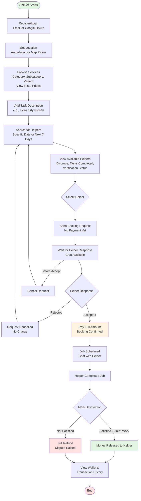
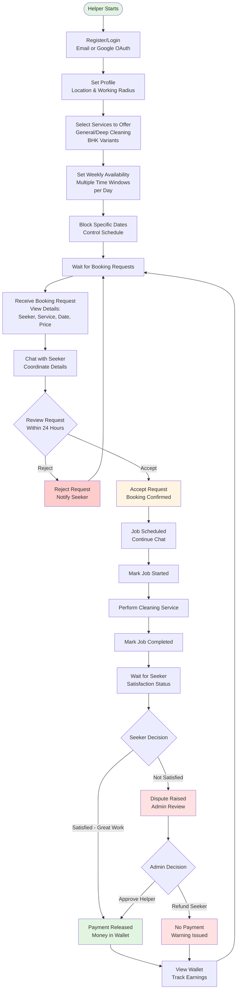
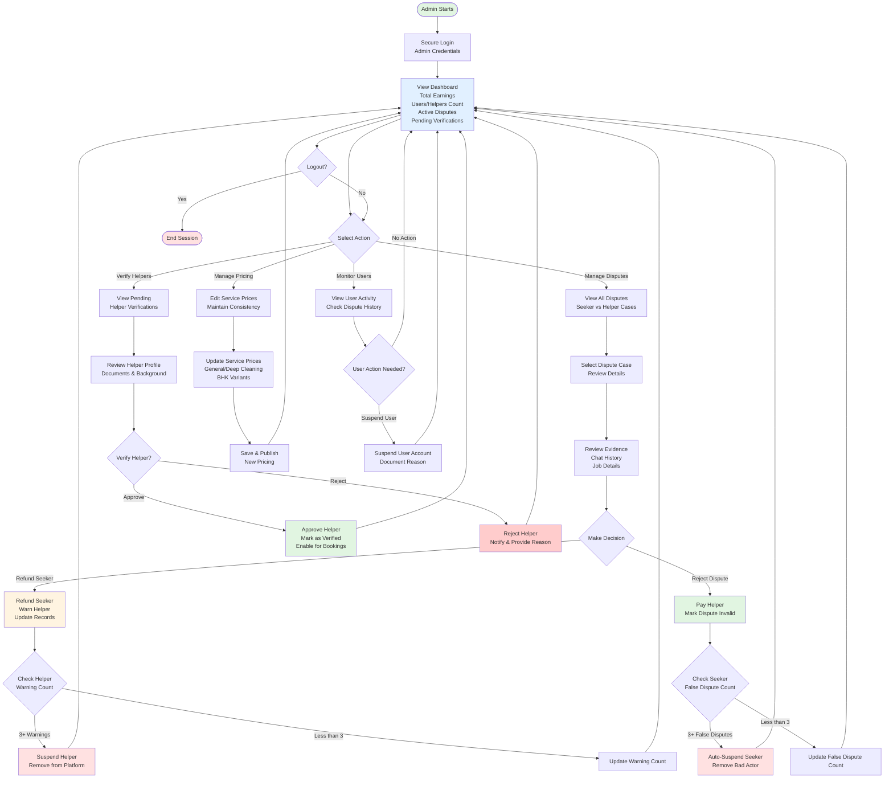

# User Stories

## Seeker Stories

|#|User Story|
|---|---|
|1|As a seeker, I want to register and log in using email/password or Google OAuth so that I can start booking quickly.|
|2|As a seeker, I want to set my location (auto-detect or map picker) and browse services (category, subcategory, variant) with fixed prices so that I know exactly what I'm paying.|
|3|As a seeker, I want to add a description about the task (e.g., "extra dirty kitchen") so that the helper knows special requirements.|
|4|As a seeker, I want to search for available helpers on a specific date or any day within the next 7 days so that I can find someone who matches my schedule.|
|5|As a seeker, I want to see a list of nearby verified helpers with distance, number of tasks completed, verification status, and availability so that I can choose the best one.|
|6|As a seeker, I want to send a booking request to a chosen helper (no payment yet) so that the helper can accept or reject it.|
|7|As a seeker, I want to be notified when the helper accepts or rejects my request so that I know the status immediately.|
|8|As a seeker, if the helper accepts, I want to pay the full amount (or deposit) to confirm the booking so that the slot is secured.|
|9|As a seeker, I want to cancel my booking request before the helper accepts (or if rejected) and get a full instant refund so that I'm not charged for changes.|
|10|As a seeker, after the job is done, I want to mark "Satisfied – Great work" (money released to helper) or "Not satisfied" (full refund + dispute raised) so that I'm protected.|
|11|As a seeker, I want to chat with the helper during the booking so that we can coordinate easily.|
|12|As a seeker, I want to view my wallet and transaction history (good to have) so that I can track my spending and payments.|

## Helper Stories

| #   | User Story                                                                                                                                             |
| --- | ------------------------------------------------------------------------------------------------------------------------------------------------------ |
| 1   | As a helper, I want to register and log in (email or Google) so that I can offer my services.                                                          |
| 2   | As a helper, I want to set my location, working radius, and which cleaning services I offer (General/Deep + BHK variants) so that seekers can find me. |
| 3   | As a helper, I want to set my weekly recurring availability (multiple time windows per day) and block specific dates so that I control my schedule.    |
| 4   | As a helper, I want to see a list of incoming booking requests with details (seeker, service, date, price) so that I can decide which jobs to take.    |
| 5   | As a helper, I want to accept or reject requests within 24 hours so that I only take jobs I want.                                                      |
| 6   | As a helper, I want to mark when I start and complete a job so that the seeker knows the status.                                                       |
| 7   | As a helper, I want to chat with the seeker so that we can coordinate easily.                                                                          |
| 8   | As a helper, I want to receive payment in my wallet only after the seeker marks "Satisfied" so that I'm paid fairly for good work.                     |
|     |                                                                                                                                                        |

## Admin Stories

| #   | User Story                                                                                                                                                             |
| --- | ---------------------------------------------------------------------------------------------------------------------------------------------------------------------- |
| 1   | As an admin, I want to log in securely so that I can manage the platform.                                                                                              |
| 2   | As an admin, I want to see a dashboard with total earnings, number of users/helpers, active disputes, and pending verifications so that I can monitor platform health. |
| 3   | As an admin, I want to see all disputes and decide to refund the seeker (and warn helper) or reject the dispute (and pay helper) so that trust is maintained.          |
| 4   | As an admin, I want to automatically suspend users who raise more than 3 false disputes so that bad actors are removed.                                                |
| 5   | As an admin, I want to verify new helpers and edit service prices so that quality and pricing stay consistent.                                                         |
|     |                                                                                                                                                                        |
|     |                                                                                                                                                                        |

